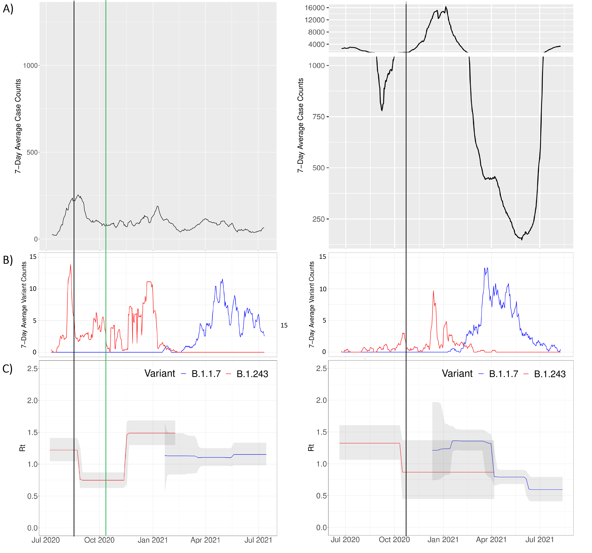
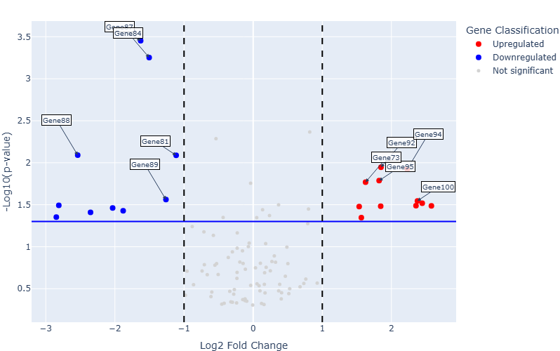

# Claire Fraser

Bioinformatics | Data Systems | Genomics

I build reproducible bioinformatics pipelines and data workflows that integrate sequencing data, experimental metadata, and analytical outputs into structured, reusable systems. My work focuses on transforming high-throughput genomics data into queryable datasets that support cross-project analysis, visualization, and scientific discovery.

---

## Featured Projects Built

::: {.columns}

::: {.column width="33%"}
### [ONT Methylation Pipeline](projects/ont-methylation.qmd)
Designed a reproducible Nextflow-based pipeline to process sequencing data into structured methylation outputs, enabling consistent cross-sample analysis.

:::

::: {.column width="33%"}
### [SARS-CoV-2 Genomic Analysis](projects/sars-cov2.qmd)
Integrated genomic sequence data and metadata to support reproducible phylogenetic analysis and cross-sample comparison of SARS-CoV-2 variants.

:::

::: {.column width="33%"}
### [NGS Figure Generator](projects/seq-visualizer.qmd)
Developed an interactive platform to standardize heterogeneous RNA-seq outputs into reproducible, publication-ready visualizations.

:::

:::