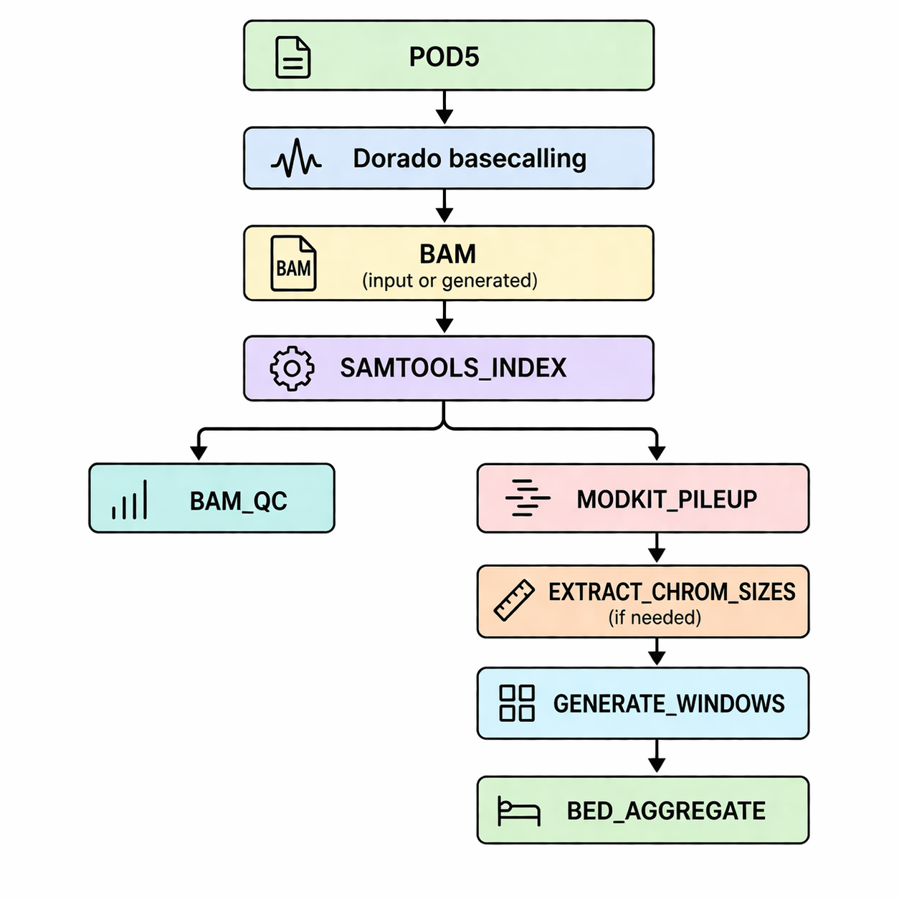

# ONT Methylation Pipeline

## Overview
An end-to-end bioinformatics pipeline for detecting and summarizing DNA methylation from Oxford Nanopore sequencing data. The workflow converts raw signal data into interpretable genomic methylation patterns through a structured and reproducible analysis pipeline.

---

## Problem
Oxford Nanopore sequencing enables direct detection of DNA modifications, but transforming raw signal data into biologically meaningful insights requires coordination across multiple tools and processing steps.

Key challenges include:

- converting raw signal data into high-quality basecalled reads  
- extracting methylation signals at scale  
- integrating heterogeneous tools into a cohesive workflow  
- summarizing methylation patterns across genomic regions  

---

## Approach
I developed a modular pipeline that processes Nanopore data from raw POD5 files through methylation aggregation.

The workflow integrates established tools within a Nextflow framework, enabling reproducible execution, scalability across datasets, and clear separation of processing stages.

---

## Pipeline Workflow

{width=60% fig-align="center"}

***ont-methylation pipeline** - Structured workflow from raw Nanopore signal data to aggregated methylation output.*

**Key stages:**

- **Basecalling:** POD5 → BAM using Dorado  
- **Indexing:** BAM indexing with SAMtools for efficient downstream access  
- **Quality Control:** assessment of alignment and read-level metrics  
- **Methylation Extraction:** per-base modification calls using Modkit pileup  
- **Genome Integration:** incorporation of chromosome sizes and genomic window definitions  
- **Aggregation:** summarization of methylation signals across defined genomic regions  

---

## Key Features

- **End-to-end processing**
  - from raw Nanopore signal data to region-level methylation summaries  

- **Modular and extensible design**
  - pipeline components can be executed independently or extended for additional analyses  

- **Reproducibility**
  - containerized execution ensures consistent environments across runs  

- **Scalability**
  - designed to handle large Nanopore sequencing datasets  

---

## Example Outputs

- BAM files containing basecalled reads  
- per-base methylation calls  
- aggregated methylation values across genomic windows  

---

## Technical Implementation

### Workflow Management

- Nextflow-based pipeline orchestration  

### Tools

- Dorado (basecalling)  
- SAMtools (indexing and QC)  
- Modkit (methylation extraction)  

### Data Processing

- generation of genomic windows  
- aggregation of methylation signals across regions  

### Reproducibility

- Docker-based containerization for consistent execution environments  

### Performance

- The pipeline leverages Nextflow parallelization to efficiently process large Nanopore datasets, enabling scalable execution across multiple samples and compute environments.

---

## Use Cases

- genome-wide methylation profiling  
- comparative epigenetic analysis  
- integration with transcriptomic or genomic datasets  

---

## GitHub Repository
https://github.com/fraserclaire/ont-methylation