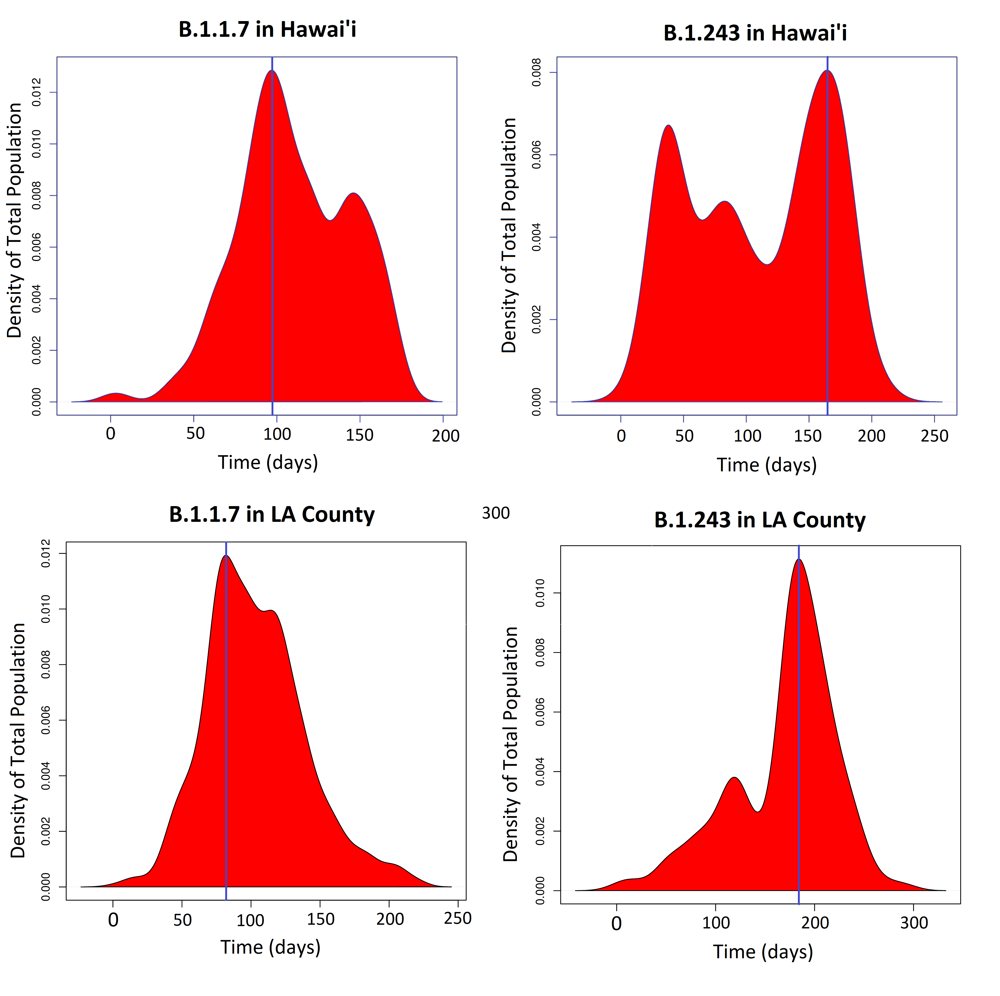
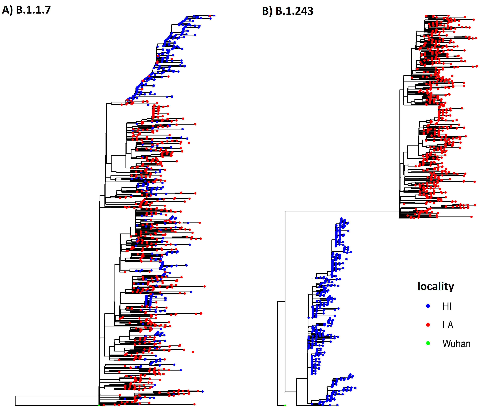
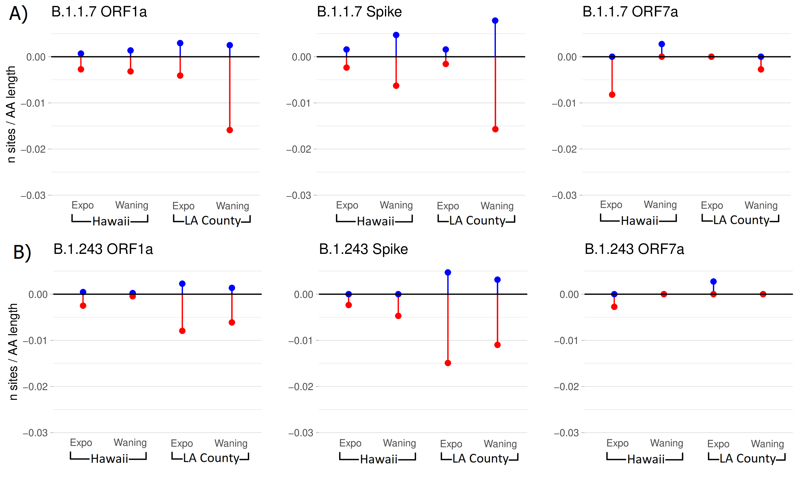
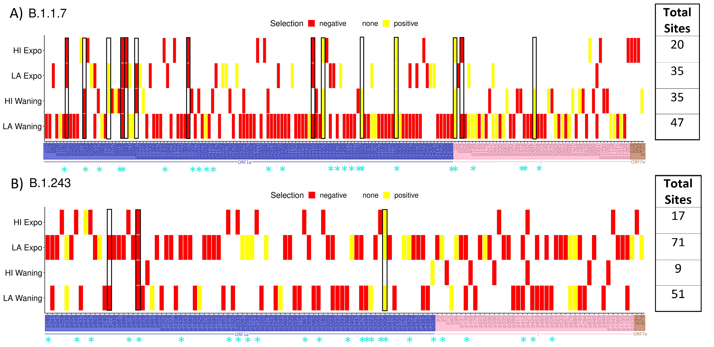

# SARS-CoV-2 Evolutionary Analysis

## Overview
An evolutionary genomics analysis of SARS-CoV-2 aimed at characterizing viral diversity, transmission dynamics, and evolutionary pressures across populations.

This analysis provides insight into how viral evolution is shaped by both transmission dynamics and selective pressures.

---

## Problem
Understanding viral evolution is critical for tracking transmission, identifying emerging variants, and interpreting functional changes in the genome.

Challenges include:

- managing and aligning large numbers of viral genomes  
- identifying meaningful sequence variation  
- reconstructing evolutionary relationships  
- interpreting mutation patterns in a biological context  

---

## Approach
I performed a comparative genomic, phylogenetic, and selection-based analysis of SARS-CoV-2 sequences to characterize temporal dynamics, geographic variation, and evolutionary pressures across variants.

The workflow includes sequence preprocessing, alignment, phylogenetic tree construction, and downstream analysis of evolutionary patterns.

---

## Analysis Workflow

- **Sequence collection and preprocessing**
  - curated viral genome sequences  

- **Multiple sequence alignment**
  - alignment of genomes for comparative analysis  

- **Phylogenetic reconstruction**
  - inference of evolutionary relationships between samples  

- **Selection analysis**
  - identification of sites under evolutionary pressure across the viral genome  

---

## Key Analyses

To characterize viral dynamics, I examined temporal trends, geographic variation, and phylogenetic structure across SARS-CoV-2 variants.

---

## Epidemiological Trends

{width=80% fig-align="center"}

*Temporal dynamics of SARS-CoV-2 cases and estimated reproduction number (Rt), including variant-specific trends.*

This figure illustrates how case counts and transmission dynamics evolve over time, highlighting differences in transmission dynamics between variants and periods of increased spread.

---

## Geographic Distribution of Variants

{width=70% fig-align="center"}

*Kernel density estimates comparing variant distributions between Hawaii County and Los Angeles County.*

This analysis highlights geographic differences in variant prevalence, indicating distinct transmission dynamics and regional differences in variant prevalence.

---

## Phylogenetic Analysis

{width=70% fig-align="center"}

*Phylogenetic trees of SARS-CoV-2 variants, with samples colored by geographic origin.*

The phylogenies reveal differences in population structure:
- one variant shows intermixing across regions, suggesting high gene flow  
- another shows clear separation, indicating more localized transmission  

These patterns provide insight into how variants spread and evolve across populations.

---

## Selection Analysis

To further characterize evolutionary pressures, I performed selection analyses to identify sites under positive or purifying selection across SARS-CoV-2 proteins.

---

### Distribution of Selected Sites

{width=85% fig-align="center"}

*Number of sites under selection across key protein-coding regions (e.g., ORF1a, Spike, ORF7a).*

This analysis highlights differences in selective pressure across genomic regions, with certain proteins exhibiting higher concentrations of sites under selection, suggesting differential functional constraints and potential adaptive evolution across genomic regions.

---

### Overlap of Selected Sites Across Regions and Phases

{width=90% fig-align="center"}

*Heatmap of sites under selection across geographic locations and epidemiological phases (exponential vs waning).*

This visualization reveals patterns of shared and unique selection signals, indicating that selective pressures vary across populations and epidemiological phases, with both shared and region-specific signals of selection.

---

## Technical Implementation

### Tools and Methods

- sequence alignment tools
- phylogenetic analysis (BEAST, Mesquite)  
- selection analysis (FUBAR, FEL, MEME)  
- downstream analysis and visualization in R/Python  

### Data Processing

- sequence filtering and formatting  
- alignment refinement  
- extraction of variant positions  

---

## Key Insights

- variant-specific differences in transmission dynamics over time  
- regional variation in variant prevalence between populations  
- contrasting phylogenetic structures indicating both widespread mixing and localized transmission  
- evidence of selection acting on specific protein-coding regions, with variation across locations and epidemiological phases  

---

## Use Cases

- viral surveillance and variant tracking  
- evolutionary analysis of pathogens  
- comparative genomics studies  

---

## GitHub Repository
https://github.com/fraserclaire/SARS-CoV-2_evolutionaryAnalysis